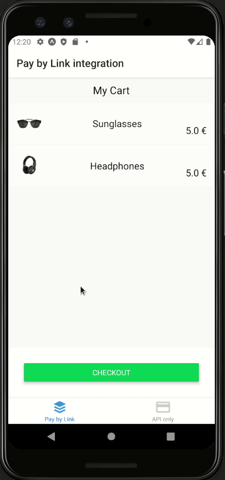

# Adyen [online payment](https://docs.adyen.com/checkout) integration for React Native

This repository includes examples of React Native application integrations for online payments with Adyen. Within this demo app, you'll find a simplified version of an e-commerce cart and checkout, complete with commented code to highlight key features and concepts of Adyen's API. Have a look at the underlying code to see how you can integrate Adyen in your Android/iOS/PWA application to give your shoppers the option to pay with their preferred payment methods, all in a seamless checkout experience. The integration is done using React Native.



## Supported Demo Integrations

Make sure the payment methods you want to use in the demo are enabled for your account. Refer to the [documentation](https://docs.adyen.com/payment-methods#add-payment-methods-to-your-account) to add missing payment methods.

Demos of the following client-side integrations are currently available in this repository:

- [Pay by Link](https://docs.adyen.com/checkout/pay-by-link)

  - [x] Ideal
  - [x] Credit card
  - [x] Credit card 3DS2
  - [x] PaySafeCard
  - [x] Klarna Pay later

**Note**: You need to [setup a webhook](https://docs.adyen.com/development-resources/webhooks) if you want to handle the results from Pay by Link.

- [API only](https://docs.adyen.com/checkout/api-only)
  - [ ] Ideal
  - [ ] Credit card

The demo leverages Adyen's API Library for Node.js ([GitHub](https://github.com/Adyen/adyen-node-api-library) | [Docs](https://docs.adyen.com/development-resources/libraries#javascript)) on the server side.

## Requirements

- NodeJS v12+
- NPM v6+
- Android/iOS device with [Expo app](https://expo.io/tools#client) installed or Android/iOS emulator

## Installation & Usage

1. Clone this repo:

```shell
git clone https://github.com/adyen-examples/adyen-react-native-online-payments.git
```

2. Navigate to the root directory and install dependencies:

```shell
npm install
```

3. Create a `./.env` file with your [API key](https://docs.adyen.com/user-management/how-to-get-the-api-key), [Origin Key](https://docs.adyen.com/user-management/how-to-get-an-origin-key), and merchant account name (all credentials are in string format):

```shell
API_KEY="your_API_key_here"
MERCHANT_ACCOUNT="your_merchant_account_here"
ORIGIN_KEY="your_origin_key_here"
```

2. Start the backend server:

This will start the express server and print out the server URL

```shell
npm run server
```

3. Copy the server URL and set it as `SERVER_URL` in `src/Service.js`, it is the IP of the machine where you started the express backend server with `npm run server`. It will be the same IP used by [Expo](https://expo.io/) to run the React Native application as well when you run the next step

4. Open another terminal to the same location and start the React Native application using [Expo](https://expo.io/). You can run the command appropriate for the platform you like

```shell
npm run android
# or
npm run ios
# or
npm run web
```

5. Follow the instructions on terminal to open the application in your Device/Emulator

To try out integrations with test card numbers and payment method details, see [Test card numbers](https://docs.adyen.com/development-resources/test-cards/test-card-numbers).

## Customize the payment page created by [Pay by Link](https://docs.adyen.com/checkout/pay-by-link)

You can customize the payment form with your brand name, logo, and a background color.

1.  Log in to your [Customer Area](https://ca-test.adyen.com/).
2.  Select Account. Under Configure, select Pay by Link.
3.  Select the web service user.
4.  Add a display name, upload a brand logo, and set a background color.
5.  You will receive a confirmation that the payment form has been updated.

## Contributing

We commit all our new features directly into our GitHub repository. Feel free to request or suggest new features or code changes yourself as well!

## License

MIT license. For more information, see the **LICENSE** file in the root directory.
